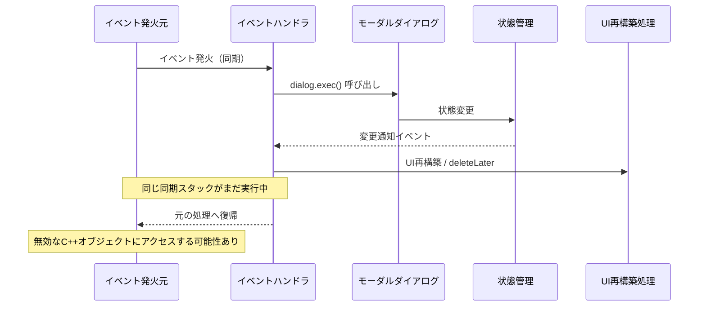
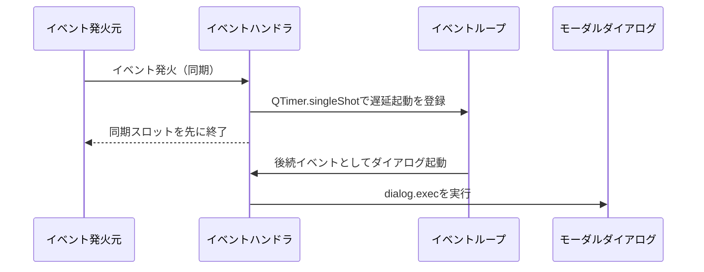
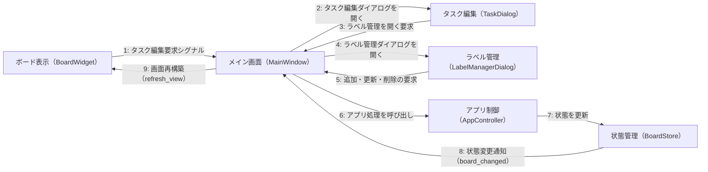
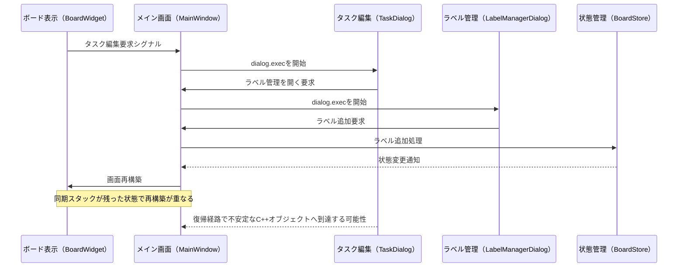
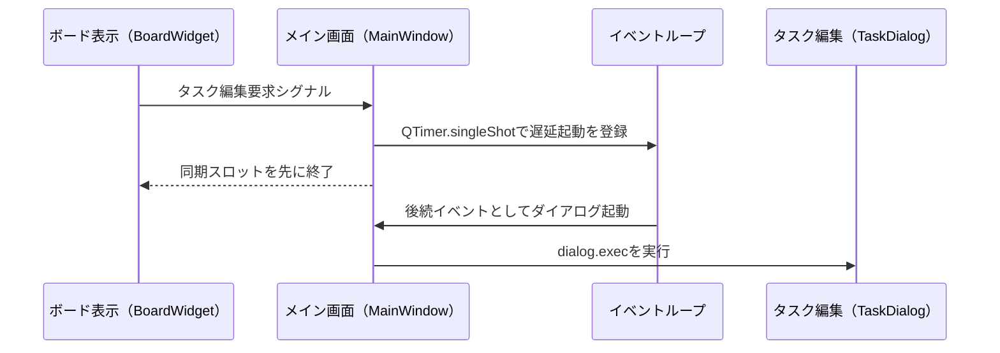

# PyQt6 モーダルダイアログ再入クラッシュ調査レポート

- 作成日: 2026-04-19
- 想定読者: このツールのソースコードを読んでいない開発者
- 主題: PyQt6で起こり得る「モーダルダイアログ + 同期シグナル処理 + UI再構築」の衝突と回避策

## 不具合事象
1. タスク編集ダイアログから「ラベル管理」を選択  
      （MainWindow -> タスク編集ダイアログ -> ラベル管理ダイアログ の順にモーダルが発生）

2. ラベルを追加

3. ラベル管理ダイアログを閉じる  
      （MainWindow -> タスク編集ダイアログ の順にモーダルが発生）

4. タスク編集ダイアログを閉じる

5. MainWindowのみ残る想定だが、システムが終了する（コンソールにエラーログなし）

## 0. 先に結論（PyQt6の汎用ハウツー）

### 0.1 今回の結論（汎用）

PyQt6では、次の条件が重なると、Python例外ではなく  **ネイティブクラッシュ（access violation）**  に至ることがある。

1. シグナルの同期スロット内で `dialog.exec()` を直接開始する
2. そのモーダル中に状態変更が起き、別シグナル経由でUI再構築（`deleteLater()` を含む）が走る
3. 元の同期コールスタックへ戻る際に、寿命が不安定な Qt C++ オブジェクトへ触れる

これは実装ミスというより、  **イベントループ再入とオブジェクト寿命管理の境界問題**  として起こる。

### 0.2 NGパターン（汎用図）

### 0.3 回避策（汎用）

1. モーダル起動はイベントキューへ逃がす
   - `QTimer.singleShot(0, ...)` で同期スロットを先に戻してから `exec()` へ入る
2. 同期スロット内では、UIツリー破壊を伴う処理を極力行わない
3. 画面再構築とダイアログ表示の責務を分離する
4. `connect`/`disconnect` をライフサイクルで対にする
5. ネイティブクラッシュ調査用ログ（`faulthandler`）を常備できる設計にする

### 0.4 OKパターン（汎用図）

## 1. 今回のツールでの発生事象

再現手順:

1. 既存タスクを開く
2. タスクダイアログからラベル管理を開く
3. 新しいラベルを追加
4. ラベル管理ダイアログを閉じる
5. タスクダイアログを閉じる

結果:

- アプリが終了
- Python側の通常例外は出ない
- `debug_fault.log` には `Windows fatal exception: access violation`

## 2. 発生事象に関係する登場人物（このツールの場合）

1. `BoardWidget`
   - 一覧UI（タスクカード）
   - タスクオープン要求シグナルを発火する起点
2. `MainWindow`
   - UI全体の司令塔
   - ダイアログ起動、シグナル接続、画面リフレッシュを統括
3. `TaskDialog`
   - タスク編集ダイアログ
   - 「ラベル管理へ遷移」の要求を返す
4. `LabelManagerDialog`
   - ラベル追加/更新/削除ダイアログ
5. `AppController`
   - UI要求をアプリ処理へ中継
6. `BoardStore`
   - 状態保持と `board_changed` 発火
7. `MainWindow.refresh_view()`
   - `board_changed` を受けてボードUIを再構築

## 3. 登場人物の関連性（図解）

## 4. 汎用問題点が今回どこに該当するか

### 4.1 対応表

1. 汎用問題: 同期スロット内で `exec()` 開始
   - 今回の該当: `BoardWidget` 由来シグナルの処理中に `MainWindow` が `TaskDialog.exec()` へ入る
2. 汎用問題: モーダル中に状態変更が起き、UI再構築が走る
   - 今回の該当: `LabelManagerDialog` のラベル追加で `board_changed` が発火し `refresh_view()` が実行される
3. 汎用問題: 同期スタック復帰時の寿命競合
   - 今回の該当: 旧UI破棄予約と復帰タイミングが競合し、ネイティブクラッシュが発生

### 4.2 本件シーケンス（修正前）

## 5. 調査アプローチと、結果からの推測

### 5.1 調査アプローチ

1. まず観測点を追加
   - `main.py` で `faulthandler`、Qt message handler、`sys.excepthook` を有効化
   - ダイアログの `init` / `done` / `closeEvent` を時系列ログ化
2. 導線ロジックを分離
   - `TaskDialog` の「ラベル管理要求」を `MainWindow` で受け、再表示時に入力復元
3. 寿命関連で疑わしい処理を緩和
   - `LabelSelectorWidget` のクリア処理を段階的に見直し
4. イベント境界を変更
   - 最終的に `QTimer.singleShot(0, ...)` で起動タイミングを非同期化

### 5.2 ログの意味

- `debug_lifecycle.log`
  - 目的: 画面遷移・シグナル・ダイアログ終了イベントを時系列で追う
  - 用途: 「どのイベント直後に落ちるか」を特定する
- `debug_fault.log`
  - 目的: Python例外で取れないネイティブ障害を記録する
  - 出力元: `faulthandler`
  - 主な出力: `Windows fatal exception`、スレッド情報、クラッシュ時のスタック

### 5.3 推測の根拠

1. 例外トレースではなく `access violation` で落ちる
2. 落ちる直前ログは「タスクダイアログ終了直後」で止まる
3. `app.exec()` 待機中にプロセスごと終了している

以上から、Pythonロジックの通常例外ではなく、**Qt C++ オブジェクト寿命競合**の可能性が高いと推測した。

## 6. 具体的な対応策（今回実施）

1. タスクダイアログ起動を直接呼び出しからキュー経由へ変更
   - `QTimer.singleShot(0, ...)` を利用
2. 適用箇所を統一
   - ボード起点のタスクオープン
   - 右クリックメニューの編集起動
3. 導線要件は維持
   - `TaskDialog` から `LabelManagerDialog` へ遷移
   - 戻った後に入力途中内容を復元

### 6.1 修正後のシーケンス

## 7. 再発防止指針（PyQt6全般に適用可能）

1. 同期スロットでモーダル `exec()` を直接開始しない
2. UI再構築とモーダル遷移を同じ同期スタックに載せない
3. ダイアログの接続解除は `finally` で保証する
4. `board_changed` など全体更新シグナルは「いつ」「どこで」発火するかを可視化する
5. ネイティブクラッシュ向けに `faulthandler` を常備し、通常例外ログと分けて運用する

---

本資料は「今回の改修依頼直前の Push 以降の差分がすべて今回改修」という前提で整理している。
