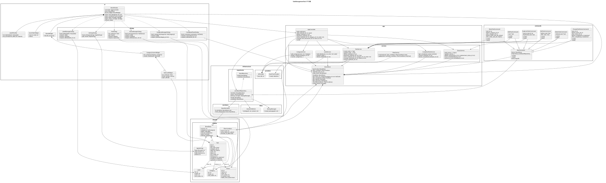

# タスク管理ツール 詳細設計たたき台（クラス構成・配置方針）

## 1. 目的

本資料は、要件定義で確定したタスク管理ツール仕様をもとに、以下を整理するための設計たたき台です。

- ディレクトリ構成案
- 各 Python ファイルと実装クラスの対応関係
- 各クラスの責務
- 各クラスが要件定義書のどの機能を担うか
- 要件定義書に明記されていないが、実装上ほぼ必要になる処理候補
- クラス図 SVG の埋め込み位置

---

## 2. 前提

- 実装言語: Python 3.12
- GUI: PyQt6
- データ保存: JSON ファイル
- Undo / Redo: コマンド方式
- ローカル完結型デスクトップアプリ
- カテゴリ・ラベル・ステータス・タスクを分離管理する構成

---

## 3. クラス図



---

## 4. ディレクトリ構成案

```text
task_management_tool/
├─ main.py
├─ app/
│  ├─ app_controller.py
│  ├─ board_store.py
│  ├─ dto.py
│  └─ services/
│     ├─ task_service.py
│     ├─ category_service.py
│     ├─ label_service.py
│     ├─ status_service.py
│     ├─ filter_service.py
│     └─ completed_task_service.py
├─ commands/
│  ├─ base_command.py
│  ├─ add_task_command.py
│  ├─ edit_task_command.py
│  ├─ delete_task_command.py
│  ├─ duplicate_task_command.py
│  ├─ move_task_command.py
│  └─ change_task_status_command.py
├─ domain/
│  ├─ models/
│  │  ├─ task.py
│  │  ├─ category.py
│  │  ├─ label.py
│  │  ├─ status.py
│  │  ├─ board_data.py
│  │  ├─ app_settings.py
│  │  └─ filter_condition.py
│  └─ enums/
│     └─ due_state.py
├─ infrastructure/
│  ├─ repositories/
│  │  ├─ board_repository.py
│  │  └─ json_board_repository.py
│  ├─ serializers/
│  │  └─ board_serializer.py
│  ├─ fileio/
│  │  ├─ atomic_file_writer.py
│  │  └─ backup_manager.py
│  └─ providers/
│     ├─ datetime_provider.py
│     └─ id_provider.py
├─ ui/
│  ├─ main_window.py
│  ├─ widgets/
│  │  ├─ board_widget.py
│  │  ├─ category_column_widget.py
│  │  ├─ task_card_widget.py
│  │  ├─ label_filter_bar.py
│  │  └─ search_bar_widget.py
│  └─ dialogs/
│     ├─ task_dialog.py
│     ├─ completed_tasks_dialog.py
│     ├─ label_manager_dialog.py
│     ├─ status_manager_dialog.py
│     ├─ category_manager_dialog.py
│     └─ settings_dialog.py
├─ utils/
│  ├─ color_utils.py
│  └─ date_utils.py
└─ docs/
   ├─ task_management_requirements.md
   ├─ task_management_class_diagram.puml
   ├─ task_management_design.md
   └─ images/
      └─ task_management_class_diagram.svg
```

---

## 5. レイヤごとの役割

| レイヤ | 主な責務 |
|---|---|
| `ui` | 画面表示、イベント受付、ダイアログ表示 |
| `app` | 画面からの操作をユースケースとして受け付ける |
| `app.services` | 業務ルール・整合性チェック・一覧抽出 |
| `commands` | Undo / Redo 可能な操作単位の表現 |
| `domain.models` | 純粋なデータモデル |
| `infrastructure` | JSON 保存、バックアップ、ID 採番、日時取得 |
| `utils` | 日付計算、色変換などの純粋関数群 |
| `docs` | 要件定義、図、設計資料 |

---

## 6. Python ファイルとクラスのマッピング

| ファイル | 実装クラス / 実装内容 |
|---|---|
| `main.py` | クラスなし。アプリ起動処理、DI 組み立て、MainWindow 起動 |
| `app/app_controller.py` | `AppController` |
| `app/board_store.py` | `BoardStore` |
| `app/dto.py` | `TaskInputData`, `TaskSearchResult`, `LabelFilterState` などの DTO 候補 |
| `app/services/task_service.py` | `TaskService` |
| `app/services/category_service.py` | `CategoryService` |
| `app/services/label_service.py` | `LabelService` |
| `app/services/status_service.py` | `StatusService` |
| `app/services/filter_service.py` | `FilterService` |
| `app/services/completed_task_service.py` | `CompletedTaskService` |
| `commands/base_command.py` | `BaseCommand` |
| `commands/add_task_command.py` | `AddTaskCommand` |
| `commands/edit_task_command.py` | `EditTaskCommand` |
| `commands/delete_task_command.py` | `DeleteTaskCommand` |
| `commands/duplicate_task_command.py` | `DuplicateTaskCommand` |
| `commands/move_task_command.py` | `MoveTaskCommand` |
| `commands/change_task_status_command.py` | `ChangeTaskStatusCommand` |
| `domain/models/task.py` | `Task` |
| `domain/models/category.py` | `Category` |
| `domain/models/label.py` | `Label` |
| `domain/models/status.py` | `Status` |
| `domain/models/board_data.py` | `BoardData` |
| `domain/models/app_settings.py` | `AppSettings` |
| `domain/models/filter_condition.py` | `FilterCondition` |
| `domain/enums/due_state.py` | `DueState` |
| `infrastructure/repositories/board_repository.py` | `BoardRepository` |
| `infrastructure/repositories/json_board_repository.py` | `JsonBoardRepository` |
| `infrastructure/serializers/board_serializer.py` | `BoardSerializer` |
| `infrastructure/fileio/atomic_file_writer.py` | `AtomicFileWriter` |
| `infrastructure/fileio/backup_manager.py` | `BackupManager` |
| `infrastructure/providers/datetime_provider.py` | `DateTimeProvider` |
| `infrastructure/providers/id_provider.py` | `IdProvider` |
| `ui/main_window.py` | `MainWindow` |
| `ui/widgets/board_widget.py` | `BoardWidget` |
| `ui/widgets/category_column_widget.py` | `CategoryColumnWidget` |
| `ui/widgets/task_card_widget.py` | `TaskCardWidget` |
| `ui/widgets/label_filter_bar.py` | `LabelFilterBar` |
| `ui/widgets/search_bar_widget.py` | `SearchBarWidget` |
| `ui/dialogs/task_dialog.py` | `TaskDialog` |
| `ui/dialogs/completed_tasks_dialog.py` | `CompletedTasksDialog` |
| `ui/dialogs/label_manager_dialog.py` | `LabelManagerDialog` |
| `ui/dialogs/status_manager_dialog.py` | `StatusManagerDialog` |
| `ui/dialogs/category_manager_dialog.py` | `CategoryManagerDialog` |
| `ui/dialogs/settings_dialog.py` | `SettingsDialog` |
| `utils/color_utils.py` | クラスなし。色変換・明暗調整関数 |
| `utils/date_utils.py` | クラスなし。残り日数、期限状態判定関数 |

---

## 7. 各クラスの役割一覧

### 7.1 app 層

#### `AppController`

| 観点 | 内容 |
|---|---|
| 主責務 | UI からの操作要求を受け取り、適切な Command / Service を呼び出す窓口 |
| 対応機能 | タスク追加、編集、削除、複製、移動、ステータス変更、カテゴリ追加・削除、ラベル管理、ステータス管理、保存 |
| 要件との対応 | メイン画面操作、ダイアログ操作、Undo / Redo 対象操作、自動保存 |
| 要件外だが必要な候補 | 例外ハンドリング、保存失敗時のメッセージ制御、DI されたサービスの呼び出し統制、UI 更新トリガ |

#### `BoardStore`

| 観点 | 内容 |
|---|---|
| 主責務 | 現在の `BoardData` とフィルタ状態を保持し、UI に参照用データを提供する状態ストア |
| 対応機能 | カテゴリごとのタスク一覧表示、完了済み一覧取得、ラベル一覧、ステータス一覧、フィルタ条件保持 |
| 要件との対応 | カテゴリ表示、タスクカード表示、完了済みタスク一覧、ラベルフィルタ、テキスト検索 |
| 要件外だが必要な候補 | シグナル通知、再描画トリガ、選択中タスクの保持、整列済みデータのキャッシュ |

#### `TaskInputData` などの DTO 候補

| 観点 | 内容 |
|---|---|
| 主責務 | ダイアログ入力値とドメインモデルの間をつなぐ中間表現 |
| 対応機能 | タスク追加・編集ダイアログからの値受け渡し |
| 要件との対応 | タスク詳細項目の入力 |
| 要件外だが必要な候補 | バリデーション前データの保持、UI 依存値の正規化 |

---

### 7.2 service 層

#### `TaskService`

| 観点 | 内容 |
|---|---|
| 主責務 | タスクに関する業務ロジックを集約する |
| 対応機能 | タスク作成、編集、削除、複製、移動、並び替え、ステータス変更、復活 |
| 要件との対応 | タスク管理、完了時の挙動、復活時の挙動、カテゴリ内優先順、複製 |
| 要件外だが必要な候補 | 更新日時自動更新、初期値設定、完了日時クリア、 sort_order 再採番、入力値正規化 |

#### `CategoryService`

| 観点 | 内容 |
|---|---|
| 主責務 | カテゴリの追加・削除・並び順管理 |
| 対応機能 | カテゴリ追加、カテゴリ削除、カテゴリ表示順更新 |
| 要件との対応 | カテゴリ管理、メニューからの追加・削除 |
| 要件外だが必要な候補 | 削除時の配下タスク件数算出、カテゴリ名重複チェック、初期カテゴリ生成 |

#### `LabelService`

| 観点 | 内容 |
|---|---|
| 主責務 | ラベルの追加・編集・削除と、タスクからのラベル除去を管理する |
| 対応機能 | ラベル管理ダイアログ、ラベル削除時の参照除去 |
| 要件との対応 | ラベル管理、ラベル削除ルール、ラベル色管理 |
| 要件外だが必要な候補 | 色重複許可ポリシー、ラベル名重複チェック、未使用ラベル一覧取得 |

#### `StatusService`

| 観点 | 内容 |
|---|---|
| 主責務 | ステータス追加・編集・削除・完了化・復活時のルールを扱う |
| 対応機能 | ステータス管理、完了処理、復活処理、置換先選択 |
| 要件との対応 | 固定ステータス、カスタムステータス、完了日時設定、復活時未着手化 |
| 要件外だが必要な候補 | 固定ステータス保護、ステータス名妥当性チェック、 `hides_from_board` 適用判定 |

#### `FilterService`

| 観点 | 内容 |
|---|---|
| 主責務 | テキスト検索とラベルフィルタを組み合わせて表示対象を絞り込む |
| 対応機能 | 同期フィルタ、複数ラベル OR、テキストとの AND |
| 要件との対応 | フィルタ / 検索全般 |
| 要件外だが必要な候補 | 大文字小文字無視、空文字時の全件表示、未ラベルタスク判定、将来の高度フィルタ拡張 |

#### `CompletedTaskService`

| 観点 | 内容 |
|---|---|
| 主責務 | 完了済みタスク一覧用の抽出・並び替え・復活・完全削除を扱う |
| 対応機能 | 完了済みタスク一覧ダイアログ、復活、削除 |
| 要件との対応 | 完了済みタスク管理 |
| 要件外だが必要な候補 | 完了日時降順ソート、元カテゴリ表示用のカテゴリ名解決、検索対象整形 |

---

### 7.3 commands 層

#### `BaseCommand`

| 観点 | 内容 |
|---|---|
| 主責務 | Undo / Redo の共通基底。 `redo()` / `undo()` 後の保存処理共通化 |
| 対応機能 | 自動保存付き Undo / Redo |
| 要件との対応 | コマンド方式、Undo / Redo、自動保存 |
| 要件外だが必要な候補 | 操作名表示、共通ログ、例外時の巻き戻し検討 |

#### `AddTaskCommand`

| 観点 | 内容 |
|---|---|
| 主責務 | タスク追加の実行と取り消し |
| 対応機能 | タスク追加、Undo / Redo |
| 要件との対応 | タスク追加、自動保存 |
| 要件外だが必要な候補 | 追加位置の決定、初期 sort_order 採番 |

#### `EditTaskCommand`

| 観点 | 内容 |
|---|---|
| 主責務 | タスク編集前後の差し替え |
| 対応機能 | タスク編集、Undo / Redo |
| 要件との対応 | タスク編集、自動保存 |
| 要件外だが必要な候補 | before / after スナップショット保持、変更差分の最小化 |

#### `DeleteTaskCommand`

| 観点 | 内容 |
|---|---|
| 主責務 | タスク削除と復元 |
| 対応機能 | 右クリック削除、詳細ダイアログ削除、Undo / Redo |
| 要件との対応 | タスク削除、自動保存 |
| 要件外だが必要な候補 | 削除後の sort_order 詰め直し、削除確認との分離 |

#### `DuplicateTaskCommand`

| 観点 | 内容 |
|---|---|
| 主責務 | タスク複製と複製取り消し |
| 対応機能 | タスク複製、Undo / Redo |
| 要件との対応 | タスク複製、自動保存 |
| 要件外だが必要な候補 | 新規 ID 付与、完了日時非複製、作成日時再設定 |

#### `MoveTaskCommand`

| 観点 | 内容 |
|---|---|
| 主責務 | タスク移動・並び替え前後の順序復元 |
| 対応機能 | ドラッグアンドドロップによる並び替え |
| 要件との対応 | タスク並び替え、カテゴリごとの優先順 |
| 要件外だが必要な候補 | 移動前後のタスク ID 順序保持、カテゴリ跨ぎ移動拡張の余地 |

#### `ChangeTaskStatusCommand`

| 観点 | 内容 |
|---|---|
| 主責務 | ステータス変更と完了日時変更の巻き戻し |
| 対応機能 | 未着手 / 作業中 / 完了の切り替え、Undo / Redo |
| 要件との対応 | ステータス変更、完了日時設定、復活時完了日時クリア |
| 要件外だが必要な候補 | `completed_at` の before / after 保持、完了一覧への反映 |

---

### 7.4 domain 層

#### `Task`

| 観点 | 内容 |
|---|---|
| 主責務 | タスクのデータ本体 |
| 対応機能 | タスクカード表示、詳細編集、検索対象、完了管理 |
| 要件との対応 | タスク詳細項目全般 |
| 要件外だが必要な候補 | 不変条件の軽いチェック、将来のメソッド追加余地 |

#### `Category`

| 観点 | 内容 |
|---|---|
| 主責務 | カテゴリ定義 |
| 対応機能 | 画面列表示 |
| 要件との対応 | カテゴリ管理 |
| 要件外だが必要な候補 | 表示順ソート補助 |

#### `Label`

| 観点 | 内容 |
|---|---|
| 主責務 | ラベル定義 |
| 対応機能 | ラベル表示、ラベルフィルタ |
| 要件との対応 | ラベル管理、ラベル色 |
| 要件外だが必要な候補 | 色コード妥当性 |

#### `Status`

| 観点 | 内容 |
|---|---|
| 主責務 | ステータス定義 |
| 対応機能 | ステータス管理、カード左帯色、一覧非表示制御 |
| 要件との対応 | 固定ステータス、カスタムステータス、完了制御 |
| 要件外だが必要な候補 | `is_system` の保護、 `hides_from_board` の統一管理 |

#### `BoardData`

| 観点 | 内容 |
|---|---|
| 主責務 | アプリ全体の永続化対象ルートオブジェクト |
| 対応機能 | JSON 保存単位 |
| 要件との対応 | 保存ファイル構成、JSON 構造 |
| 要件外だが必要な候補 | バージョンアップ時のマイグレーション起点 |

#### `AppSettings`

| 観点 | 内容 |
|---|---|
| 主責務 | アプリ設定値の保持 |
| 対応機能 | 設定ダイアログ |
| 要件との対応 | 将来の共通設定管理 |
| 要件外だが必要な候補 | テーマ、日付表示形式、保存先パス |

#### `FilterCondition`

| 観点 | 内容 |
|---|---|
| 主責務 | 現在の絞り込み条件を表現する |
| 対応機能 | テキスト検索、ラベルフィルタ |
| 要件との対応 | フィルタ / 検索 |
| 要件外だが必要な候補 | 将来の「完了含む」「期限ありのみ」等の拡張余地 |

#### `DueState`

| 観点 | 内容 |
|---|---|
| 主責務 | 期限状態の列挙値 |
| 対応機能 | 残り日数色分け |
| 要件との対応 | 期限表示、期限色分け |
| 要件外だが必要な候補 | `OVERDUE`, `TODAY`, `UPCOMING`, `NONE` などの統一表現 |

---

### 7.5 infrastructure 層

#### `BoardRepository`

| 観点 | 内容 |
|---|---|
| 主責務 | 永続化インターフェース |
| 対応機能 | 保存先抽象化 |
| 要件との対応 | JSON 保存 |
| 要件外だが必要な候補 | 将来の DB 版実装差し替え余地 |

#### `JsonBoardRepository`

| 観点 | 内容 |
|---|---|
| 主責務 | `BoardData` を JSON ファイルに保存 / 読み込みする |
| 対応機能 | 自動保存、起動時読み込み |
| 要件との対応 | JSON 保存、単一ファイル管理、bak 前提保存 |
| 要件外だが必要な候補 | 初回起動時の初期データ生成、読み込み失敗時復旧導線 |

#### `BoardSerializer`

| 観点 | 内容 |
|---|---|
| 主責務 | モデル <-> dict 変換 |
| 対応機能 | JSON シリアライズ / デシリアライズ |
| 要件との対応 | JSON 構造例への対応 |
| 要件外だが必要な候補 | バージョン差異吸収、欠損項目補完、デフォルト値補完 |

#### `AtomicFileWriter`

| 観点 | 内容 |
|---|---|
| 主責務 | 一時ファイル経由で安全に保存する |
| 対応機能 | 自動保存時の破損防止 |
| 要件との対応 | 保存途中のファイル破損防止 |
| 要件外だが必要な候補 | `tmp` への保存後 rename、失敗時 cleanup |

#### `BackupManager`

| 観点 | 内容 |
|---|---|
| 主責務 | `.bak` ファイルを作成する |
| 対応機能 | バックアップ |
| 要件との対応 | `.bak` 作成、障害復旧 |
| 要件外だが必要な候補 | 世代管理、破損ファイル退避、復旧候補提示 |

#### `DateTimeProvider`

| 観点 | 内容 |
|---|---|
| 主責務 | 現在時刻取得を抽象化する |
| 対応機能 | 作成日時 / 更新日時 / 完了日時 設定 |
| 要件との対応 | 作成日時、更新日時、完了日時自動設定 |
| 要件外だが必要な候補 | テスト時の固定時刻注入 |

#### `IdProvider`

| 観点 | 内容 |
|---|---|
| 主責務 | ID 生成を抽象化する |
| 対応機能 | タスク / カテゴリ / ラベル / ステータス ID 発行 |
| 要件との対応 | 一意 ID 管理 |
| 要件外だが必要な候補 | UUID / 視認性ある採番方式の切り替え |

---

### 7.6 ui 層

#### `MainWindow`

| 観点 | 内容 |
|---|---|
| 主責務 | メイン画面全体のレイアウトとメニューを構築する |
| 対応機能 | メイン画面、メニュー、ダイアログ起動 |
| 要件との対応 | 画面一覧、メイン画面レイアウト案、メニュー項目 |
| 要件外だが必要な候補 | ショートカット登録、ステータスバー、保存失敗通知表示 |

#### `BoardWidget`

| 観点 | 内容 |
|---|---|
| 主責務 | カテゴリ列全体の配置管理 |
| 対応機能 | カテゴリ横並び表示 |
| 要件との対応 | カテゴリ表示 |
| 要件外だが必要な候補 | 再描画効率化、空カテゴリ表示、横スクロール対応 |

#### `CategoryColumnWidget`

| 観点 | 内容 |
|---|---|
| 主責務 | 1 カテゴリ分の列 UI |
| 対応機能 | カテゴリ名表示、タスク追加ボタン、カード一覧表示 |
| 要件との対応 | カテゴリ列、各列上部のタスク追加ボタン |
| 要件外だが必要な候補 | ドロップ受け口、件数表示、空状態メッセージ |

#### `TaskCardWidget`

| 観点 | 内容 |
|---|---|
| 主責務 | タスク 1 件分のカード表示 |
| 対応機能 | タスク名、期限、ラベル、残り日数、ステータス帯、背景色、右クリックメニュー |
| 要件との対応 | タスクカード表示、色表現、期限表示、削除導線 |
| 要件外だが必要な候補 | ホバー表現、選択強調、ドラッグ開始イベント、ラベル折り返し制御 |

#### `LabelFilterBar`

| 観点 | 内容 |
|---|---|
| 主責務 | ラベルボタン型フィルタ UI |
| 対応機能 | ラベル ON/OFF 切り替え、未ラベル選択肢表示 |
| 要件との対応 | ラベルフィルタ UI |
| 要件外だが必要な候補 | OFF 色の暗色化、ホバー表現、横並び・折り返し表示 |

#### `SearchBarWidget`

| 観点 | 内容 |
|---|---|
| 主責務 | テキスト検索欄とクリア周辺 UI |
| 対応機能 | テキスト検索、フィルタクリア補助 |
| 要件との対応 | テキスト検索、フィルタクリア |
| 要件外だが必要な候補 | 入力ディレイ調整、ショートカット、プレースホルダ文言 |

---

### 7.7 dialogs 層

#### `TaskDialog`

| 観点 | 内容 |
|---|---|
| 主責務 | タスク追加 / 編集用ダイアログ |
| 対応機能 | タスク詳細編集、削除、複製、ステータス変更 |
| 要件との対応 | タスク詳細ダイアログ、タスク追加 / 編集 / 削除 / 複製 |
| 要件外だが必要な候補 | 入力バリデーション、色選択 UI、カテゴリ選択、ステータス選択 |

#### `CompletedTasksDialog`

| 観点 | 内容 |
|---|---|
| 主責務 | 完了済みタスク一覧の表示と操作 |
| 対応機能 | 詳細表示、復活、完全削除、検索 |
| 要件との対応 | 完了済みタスク管理 |
| 要件外だが必要な候補 | 完了日時降順ソート表示、元カテゴリ名表示、空状態表示 |

#### `LabelManagerDialog`

| 観点 | 内容 |
|---|---|
| 主責務 | ラベルの追加・編集・削除 |
| 対応機能 | ラベル管理 |
| 要件との対応 | ラベル管理ダイアログ |
| 要件外だが必要な候補 | 色選択パレット、使用中件数表示 |

#### `StatusManagerDialog`

| 観点 | 内容 |
|---|---|
| 主責務 | ステータスの追加・編集・削除 |
| 対応機能 | ステータス管理 |
| 要件との対応 | ステータス管理ダイアログ |
| 要件外だが必要な候補 | 固定ステータス編集不可制御、置換先選択 UI、色選択 |

#### `CategoryManagerDialog`

| 観点 | 内容 |
|---|---|
| 主責務 | カテゴリの追加・削除 |
| 対応機能 | カテゴリ管理 |
| 要件との対応 | カテゴリ追加 / 削除 |
| 要件外だが必要な候補 | 配下タスク件数表示、削除警告強化 |

#### `SettingsDialog`

| 観点 | 内容 |
|---|---|
| 主責務 | アプリ全体の設定変更 |
| 対応機能 | 将来の設定管理 |
| 要件との対応 | 設定ダイアログ |
| 要件外だが必要な候補 | テーマ、日付表示形式、データ保存場所設定 |

---

## 8. クラス間の責務分離方針

### 8.1 依存の流れ

```text
UI -> AppController -> Command -> Service -> Store -> Repository
```

### 8.2 分離方針

- `ui` は表示とユーザー操作の受け付けに専念する
- `AppController` は操作の受付窓口に専念する
- 実際の業務ルールは `Service` に寄せる
- Undo / Redo 対象操作は `Command` に閉じ込める
- データ本体は `domain.models` に置く
- ファイル保存は `infrastructure` に閉じ込める

---

## 9. 要件定義に未記載だが、実装上ほぼ必要になる処理候補

| 分類 | 候補 |
|---|---|
| 入力検証 | タスク名空入力チェック、カテゴリ名 / ラベル名 / ステータス名の空文字禁止 |
| 整合性 | ラベル削除後の参照除去、ステータス削除時の置換、カテゴリ削除前の件数算出 |
| 自動値設定 | `created_at`, `updated_at`, `completed_at`, `sort_order` 自動採番 |
| 表示補助 | 残り日数計算、期限状態判定、ラベル OFF 色生成、期限色決定 |
| 保存安全性 | 一時ファイル保存、bak 作成、保存失敗時のロールバック、起動時破損検知 |
| UX | 空一覧時メッセージ、ダイアログ入力エラー表示、削除確認メッセージの具体化 |
| テスト容易性 | 時刻取得抽象化、ID 生成抽象化、Repository 抽象化 |
| 将来拡張 | カテゴリ跨ぎ移動、テーマ切替、高度フィルタ、添付ファイル、URL リンク |

---

## 10. 実装優先順位の提案

### フェーズ 1: 最低限の土台

- `Task`
- `Category`
- `Label`
- `Status`
- `BoardData`
- `JsonBoardRepository`
- `BoardSerializer`
- `AtomicFileWriter`
- `BackupManager`

### フェーズ 2: アプリ本体の骨格

- `BoardStore`
- `AppController`
- `TaskService`
- `StatusService`
- `FilterService`

### フェーズ 3: メイン画面の成立

- `MainWindow`
- `BoardWidget`
- `CategoryColumnWidget`
- `TaskCardWidget`
- `SearchBarWidget`
- `LabelFilterBar`

### フェーズ 4: ダイアログと操作

- `TaskDialog`
- `CompletedTasksDialog`
- `LabelManagerDialog`
- `StatusManagerDialog`
- `CategoryManagerDialog`

### フェーズ 5: Undo / Redo

- `BaseCommand`
- `AddTaskCommand`
- `EditTaskCommand`
- `DeleteTaskCommand`
- `MoveTaskCommand`
- `DuplicateTaskCommand`
- `ChangeTaskStatusCommand`

---

## 11. 補足

### 11.1 `main.py` にクラスを置かない理由

`main.py` はエントリポイントに限定し、アプリ組み立てだけを担当させる方が保守しやすいためです。

### 11.2 `utils` をクラス化しない理由

色変換や日付計算は状態を持たない純粋関数の方が扱いやすく、テストもしやすいためです。

### 11.3 `dto.py` を用意する理由

UI の入力値をそのままドメインモデルへ流し込むと、未検証値や文字列変換ロジックが散らばるためです。

---

## 12. まとめ

この構成では、以下を狙っています。

- UI と業務ロジックを分離する
- JSON 保存と UI 更新を切り離す
- Undo / Redo を後付けではなく中心設計にする
- 要件定義書で確定した機能をクラス単位へ自然に割り当てる
- 将来拡張に耐えるディレクトリ構成にする

特に重要な中心クラスは以下です。

- `BoardStore`
- `AppController`
- `TaskService`
- `StatusService`
- `JsonBoardRepository`
- `TaskDialog`
- `TaskCardWidget`
- `BaseCommand` とその派生クラス

以上を、実装前の詳細設計たたき台とします。
